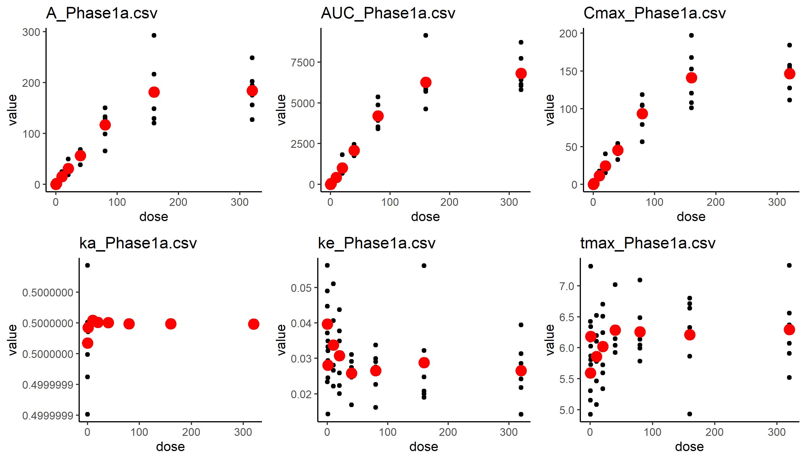
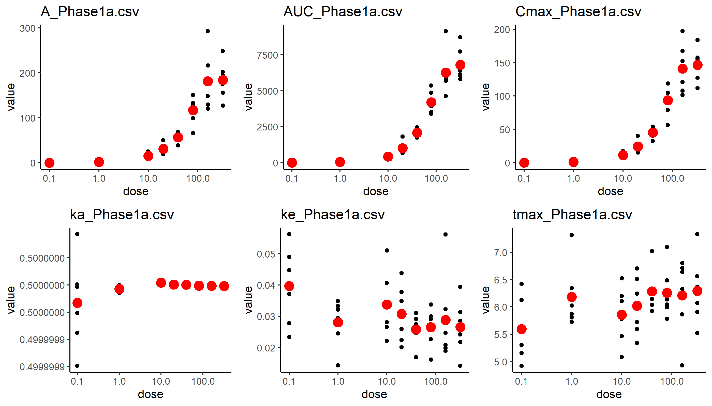
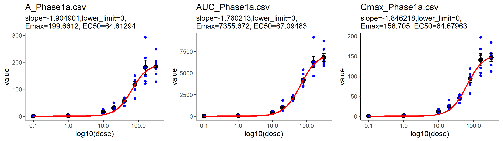

# 1compartment model analysis

## 算出値のdoseごとの変化をプロット

- 黒：生データ。赤：平均
- A, AUC, Cmaxはx軸の対数をとったらログロジスティックモデルでフィッティングできそう。

**x軸を対数にしてプロット**

- いけそう。

## ログロジスティックモデルでフィッティング

$$y = c + \frac{d-c}{1+exp(b(log(x)-log(e)))}$$

- b:slope, c:lower_limit, d:Emax, e:EC50

- 青色：生データ。黒：平均
- A, AUC, Cmaxできれいにフィッティングできた。
- **Aの個人内変動、個人間変動を解析して分布を作ることでkeと合わせて仮想患者の薬物動態をシミュレーションできる。**