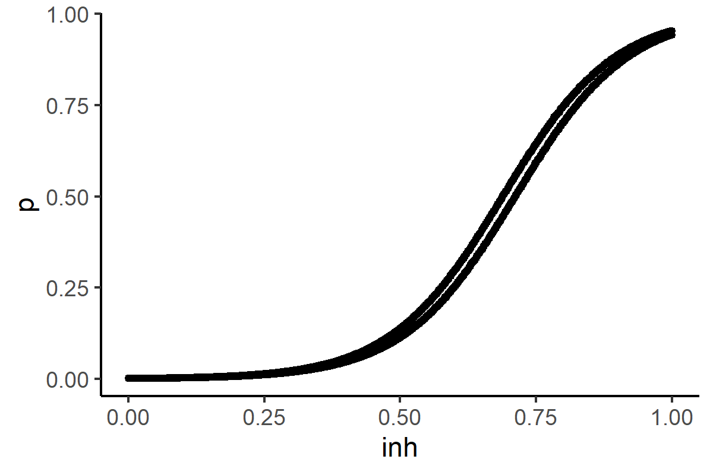
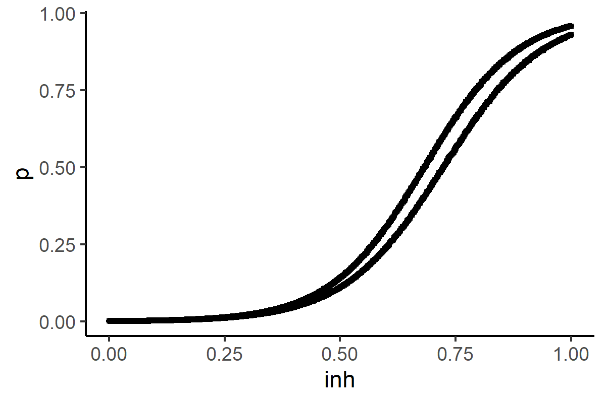

# ロジスティック回帰について

まず、斎藤さんが行った方法をたどった。

- 全体のデータに対してlinear modelのパラメータ推定を行った。

- pythonのスクリプトとほぼ同じbeta0,beta1の値が得られた。

## 非線形混合効果を用いた個人間変動の反映

- Emaxモデルではnlme関数がエラーを起こしたのでlinearモデルでのみ検証した。

- 次の3パターンについて考えた
  - model_l1 : logit=beta0+beta1*x+eta2
  - model_l2 : =beta0+(beta1+eta1)*x
  - model_l3 : = beta0 + (beta1+eta1)*x + eta2

- model_l1とmodel_l2がAIC,BICともに同じぐらいでmodel_l3より小さい
  - model_l1とmodel_l2を用いて次の検証へ

### 阻害率と改善確率の対応

- 二値データをプロットしているだけだと味気ないので、阻害率0.1ごとにTRUEになる確率を計算し、阻害率ごとの目安的な改善確率を算出した。

- 黒：全体の改善確率

### 得られたmodelの状態
- model_l1のそれぞれのモデル。ほとんど動かない。

- model_l2のそれぞれのモデル。model_l1よりは動く？

## 大体の予測区間の見積もり

- 現状のモデルでシミュレーションをしたらどういった分布になるかを見積もるため、モンテカルロシミュレーション的なものを行った。
- 斎藤さんがlinear modelが誤差項のsdを計算したモデル、model_l1、model_l2で実行
- 阻害率0.01ずつ100個仮想データを生成した。
- 青色：シミュレーション、黒色：全体の改善確率（目安の）

### 結果　

- 斎藤さんの見積もり

- model_l1

- model_l2

- それぞれの患者さんについて最尤法により誤差項のSDを求めるよりも非線形混合効果のnlme関数を用いると推定される誤差項のSDが小さくなる。
  - **どの誤差の分布を選ぶべきか**