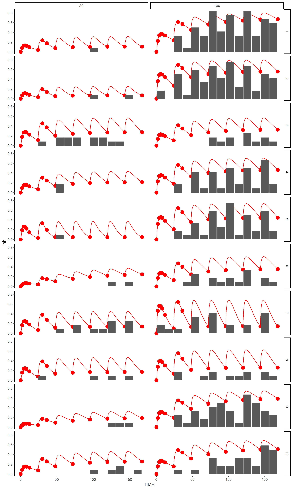
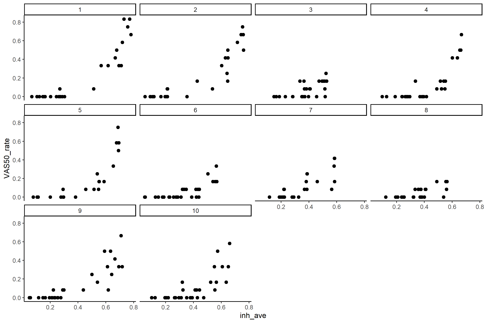
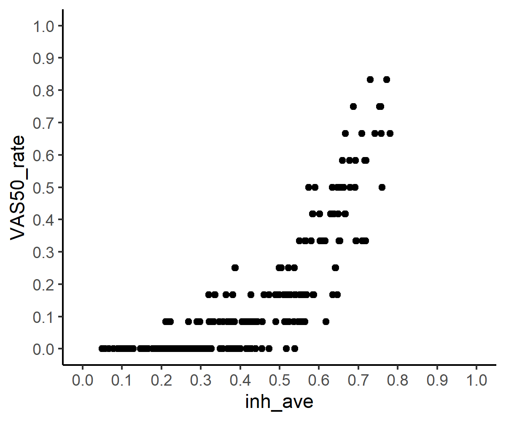
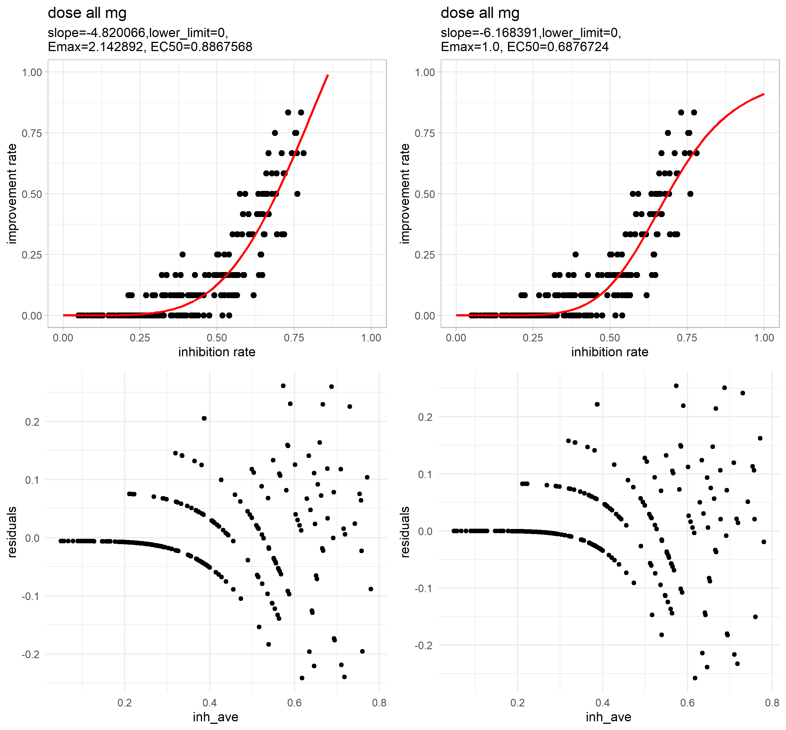
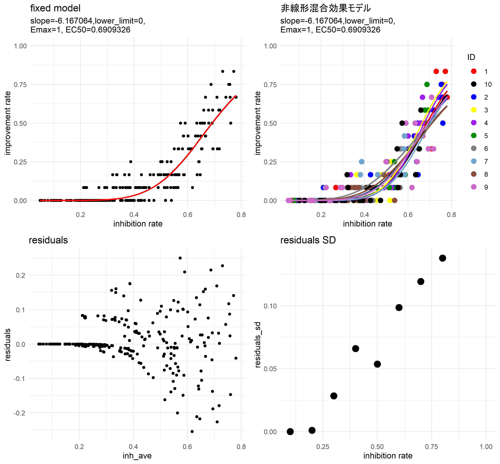
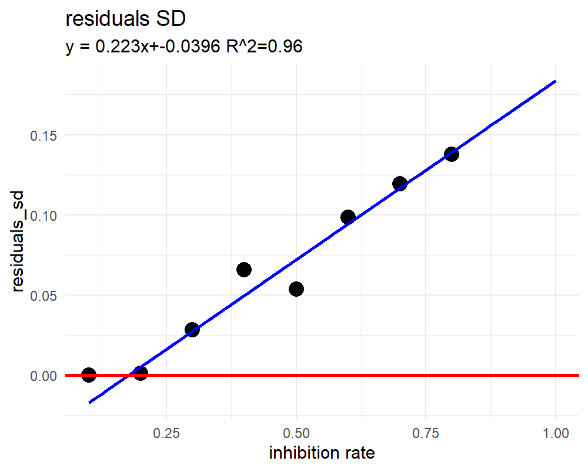

# 阻害率から改善率を予測する。

- 改善率と阻害率を合わせて考えるために、12hごとの阻害率の平均値を計算し、それとVAS50の対応を見た。

## 阻害率と改善率の対応

- 視覚的にわかりやすくするために一時的にVAS50の時間を-6時間してプロット

- 赤色阻害率の推移
- 棒グラフで示す都合上改善率を-6hしてプロットしている。
  - その方が直感的にわかりやすい。

### 阻害率の12h平均とVAS50の12h改善率

- 計算方法
  

- 各人

- 全ての容量、IDを合わせて

- この分布をモデルにあてはめたい。
    - ロジスティックモデル

## パラメータ分布の推定

$$y = c + \frac{d-c}{1+exp(b(log(x)-log(e)))}$$

- b:slope, c:lower_limit, d:Emax, e:EC50

### 固定効果のみ(drcでのフィッティング)

- 赤線がフィッティングした関数
- Emax,lower_limitを指定せずにフィッティング（左）
  - lower_limit=0になりEmaxが1以上の値となった。
    - そのため、Emax=1と指定してフィッティング（右）
      - 改善率は1以上になりえないから。
- 残差の分布が一定の分布に従っていない感じがして気持ち悪い
  - 非線形混合効果を試してみる。

### 非線形混合効果モデル

- lower_limit, Emaxは0と仮定
- slopeとEC50が個体間で差があると考えた。
    - slopeとEC50は正規分布に従うと仮定
        - 対数正規分布の可能性が高いかもしれないが技術的にすぐ対応できなそうだった

→　非線形混合効果モデルでパラメータの分布を推定

- slopeとEC50のSD
  - slope:1.281413
  - EC50:0.01880815

- 残差が一定のばらつきをとるようになった。（左下）
  - 残差のSDが阻害率に応じて線形的に上昇していくことが確認された（右下）
    - 非線形混合効果によるパラメーターのばらつきに加え、残差の分布を阻害率から計算することにより仮想患者の再現ができるのではないか

- 残差のSD

- 一定の阻害率まではSD=0(赤色)、一定の阻害率からはSDが青色の線形回帰に従う

# 出力したcsv

- multi_conc_inh.csv
  - 1分間おきのdrug Xの血中濃度とIL-31阻害率
- inh_VAS50.csv
  - 12hおきの阻害率の平均値と改善率

